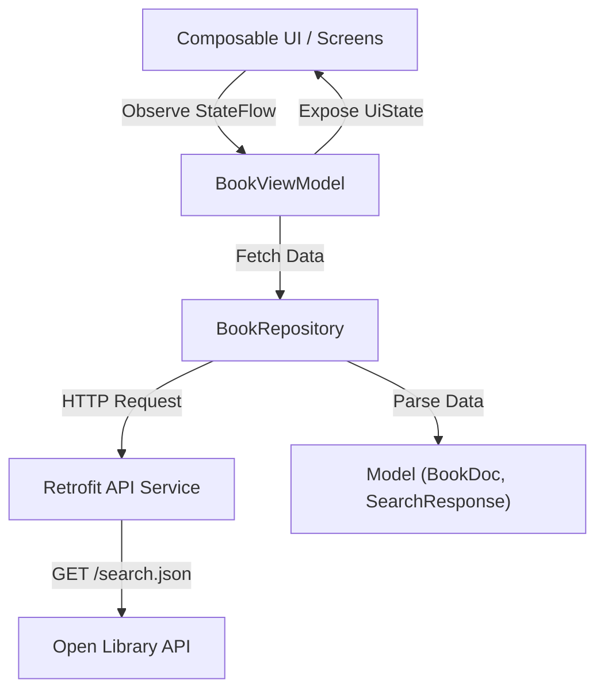

# Haydar Buku (Responsi Pemrograman Mobile)

Aplikasi Android berbasis **Jetpack Compose** untuk pencarian buku menggunakan **Open Library API**. Dikembangkan dengan arsitektur **MVVM** (Model-View-ViewModel) dan menerapkan state management modern menggunakan Kotlin Coroutines & StateFlow.

---

## 📱 Fitur Utama
1. **Pencarian Buku (Search)**: Pengguna dapat mencari buku berdasarkan kata kunci tertentu dengan mudah.
2. **Indikator Loading**: Menampilkan status loading saat data sedang dimuat dari API.
3. **Penanganan Kesalahan (Error Handling)**: Menampilkan pesan error yang ramah pengguna apabila terjadi kegagalan jaringan atau server.
4. **Detail Buku**: Menampilkan informasi lengkap mengenai buku yang dipilih (Judul, Penulis, Tahun Terbit, Jumlah Edisi, Bahasa, dll.).

---

## 📷 Screenshot Aplikasi

| Home Screen (Pencarian & Daftar Buku) |      Detail Screen (Informasi Buku)      |
|:-------------------------------------:|:----------------------------------------:|
|   |  |


## 🏗️ Arsitektur Aplikasi
Aplikasi ini menerapkan pola arsitektur **MVVM (Model-View-ViewModel)** dengan pemisahan concern yang jelas:



- **Composable (UI Layer)**: `HomeScreen`, `DetailScreen`, `BookItem` yang bersifat reaktif terhadap perubahan state.
- **ViewModel (`BookViewModel`)**: Mengelola state UI (`UiState`) menggunakan `StateFlow` (`Loading`, `Success`, `Error`) dan menangani business logic pencarian.
- **Repository (`BookRepository`)**: Menjadi perantara antara data source (Retrofit) dan ViewModel.
- **Retrofit API Service (`BookApiService`)**: Mengambil data dari endpoint Open Library.
- **Model (`BookDoc`, `SearchResponse`, dll.)**: Representasi data / data transfer object (DTO).

---

## 🌐 API Endpoint
Aplikasi ini menggunakan layanan publik dari **Open Library**:
- **Base URL**: `https://openlibrary.org/`
- **Endpoint Search**: `https://openlibrary.org/search.json?q={keyword}&limit=20`

Contoh Request:
```http
GET https://openlibrary.org/search.json?q=indonesia&limit=20
```

---

## ⚙️ Spesifikasi Teknis & Dependencies
- **Bahasa**: Kotlin
- **UI Toolkit**: Jetpack Compose (Material 3)
- **Dependency Injection / Lifecycle**: androidx.lifecycle (`ViewModel`, `viewModelScope`, `StateFlow`)
- **Networking**: Retrofit 2 (`com.squareup.retrofit2:retrofit:2.11.0`) + Gson Converter
- **Navigasi**: Jetpack Navigation Compose (`2.8.4`)
- **Icons**: Jetpack Compose Material Icons (`material-icons-core`, `material-icons-extended`)

---

## 🚀 Cara Menjalankan Proyek
1. Clone repository ini ke komputer Anda:
   ```bash
   git clone https://github.com/username/responsipemmobbuku.git
   ```
unduh atau buka direktori proyek menggunakan **Android Studio** (Koala / Ladybug / Jellyfish atau versi terbaru).
2. Lakukan **Gradle Sync** untuk mengunduh semua dependencies yang dibutuhkan.
3. Pastikan Anda terhubung ke internet (karena aplikasi mengambil data secara online dari Open Library API).
4. Jalankan aplikasi pada Emulator Android atau perangkat fisik (Minimum SDK 24).

---

*Dikembangkan untuk Tugas Responsi Pemrograman Mobile.*
